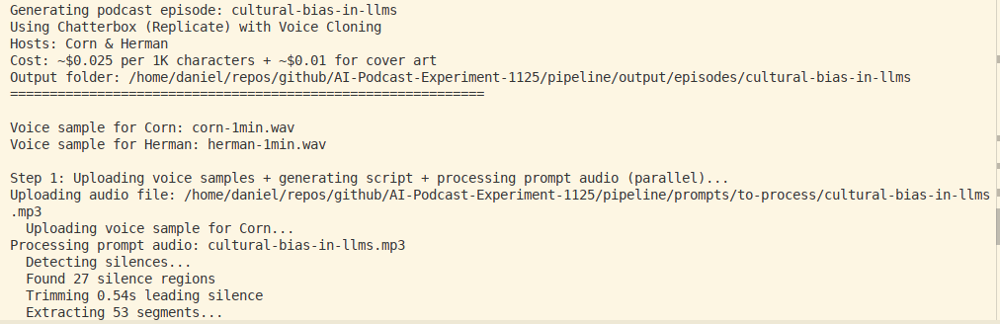
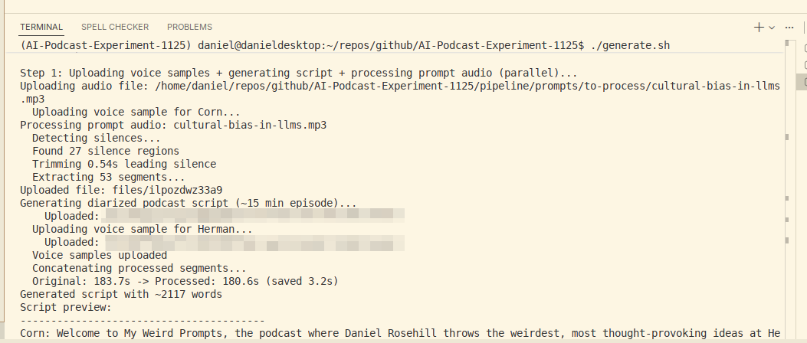
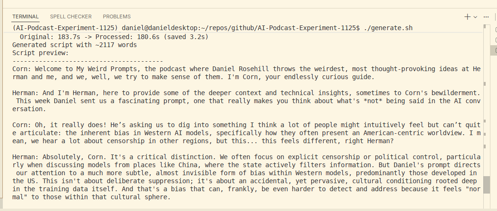
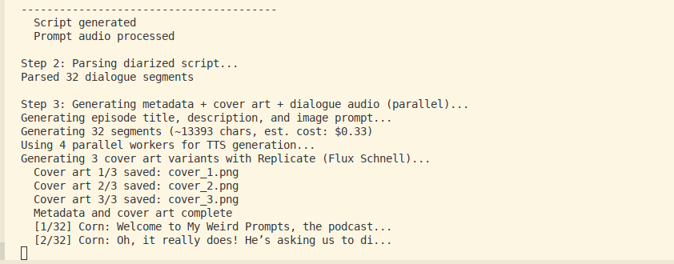
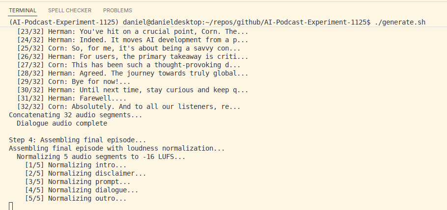
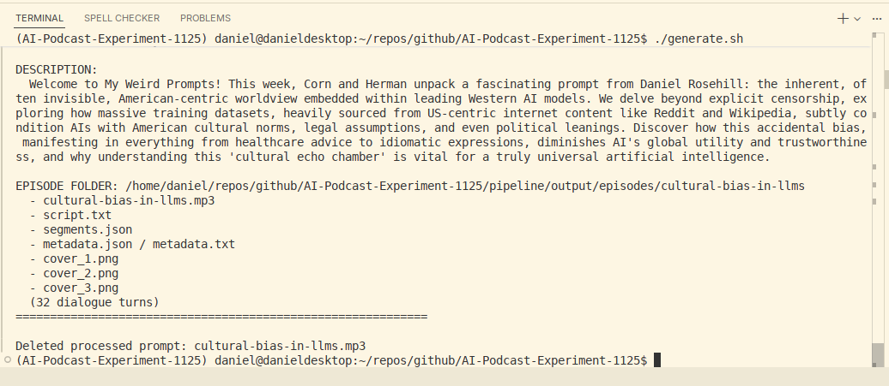
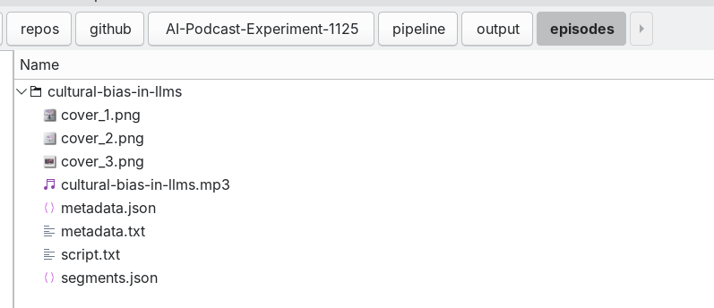
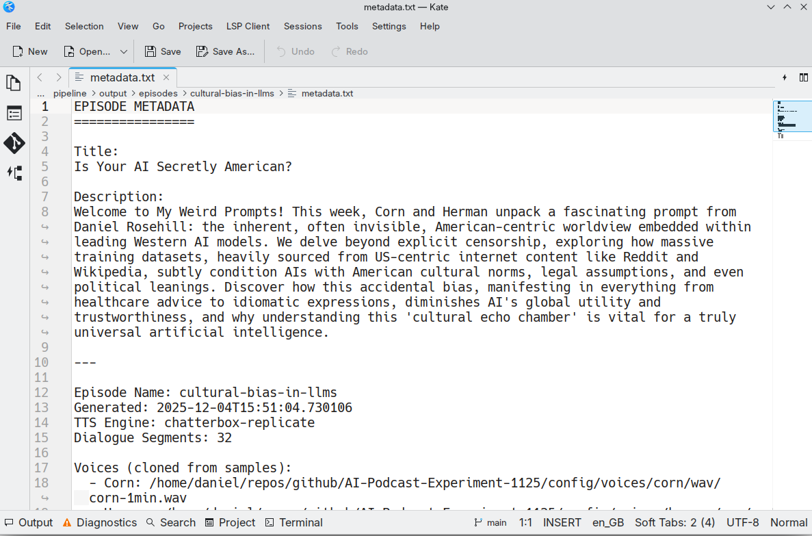

# My Weird Prompts - Podcast Production Pipeline


[](https://open.spotify.com/show/4RlBls1ZQxs4ciREOR8vpU)
[](https://anchor.fm/s/1082efa78/podcast/rss)

The production pipeline for *My Weird Prompts*, a semi-automated AI podcast that combines human-recorded prompts with AI-generated responses, rendered as listenable audio episodes.

## About the Show

*My Weird Prompts* is a podcast where the host shares interesting, unusual, or thought-provoking prompts and AI responds with detailed, conversational explanations. The result is a hybrid human+AI podcast format that preserves the authenticity of the original question while leveraging AI for comprehensive responses.

## The Approach

This workflow addresses several limitations with existing AI podcast solutions:

### Why Not Notebook LM?
Notebook LM produces great content, but the podcast style tends toward a specific Americanized, California-esque host format that doesn't suit everyone's preferences.

### Why Not Pure TTS Workflows?
Previous N8N workflows (speech-to-text → LLM → text-to-speech) work but have issues:
- Quality TTS (like ElevenLabs) is expensive for regular 30-minute episodes
- Fully synthetic output lacks the human element

### The Solution
A hybrid approach:
1. **Human prompts** - Recorded audio prompts from the creator
2. **AI responses** - Multimodal AI generates podcast-style dialogue
3. **Combined output** - Final episode includes: intro jingle → disclaimer → human prompt → AI dialogue → outro jingle

## Workflow

```
[Audio Prompt Recording]
        ↓
[Gemini: Transcribe + Generate Script]
        ↓
[Chatterbox TTS via Replicate]
        ↓
[Assemble Episode]
   - Intro jingle
   - Disclaimer
   - Human prompt audio
   - AI dialogue (~15 min)
   - Outro jingle
        ↓
[Render Normalized MP3 + Metadata]
        ↓
[Upload to Spotify]
```

## Quick Start

```bash
# Drop audio prompts into the queue
cp your-prompt.mp3 pipeline/prompts/to-process/

# Generate episodes
./generate.sh

# Output appears in pipeline/output/episodes/<episode-name>/
```

## Generation Process

Here's what the episode generation looks like in action:

---

### 1. Startup & File Detection

The generator scans for audio prompts in the queue:


---

### 2. Voice Sample Upload & Audio Processing

Voice samples are uploaded to Replicate while the prompt audio is processed (silence detection, trimming):



---

### 3. Script Generation

Gemini transcribes the prompt and generates a ~15-minute diarized podcast script:



---

### 4. AI Dialogue Preview

The generated script features natural conversation between hosts Corn and Herman:



---

### 5. TTS & Cover Art Generation

Parallel workers generate voice-cloned audio segments while Flux Schnell creates cover art variants:



---

### 6. Episode Assembly & Normalization

All 32 dialogue segments are concatenated, then the full episode is assembled with loudness normalization to -16 LUFS:



---

### 7. Generation Complete

Final episode with auto-generated description, ready for upload:



---

### 8. Output Files

Each episode gets its own folder with the final MP3, cover art variants, script, and metadata:



---

### 9. Generated Metadata

Full episode metadata including title, description, and technical details:



---

## Cost

Approximately $0.40 per 15-minute episode (Replicate TTS + Gemini + cover art generation).

## Repository Structure

- `pipeline/generators/` - Episode generation scripts
- `pipeline/prompts/` - Audio prompt queue (to-process/done)
- `pipeline/output/episodes/` - Rendered episodes
- `pipeline/show-elements/` - Intro/outro jingles
- `config/voices/` - Voice samples for TTS cloning
